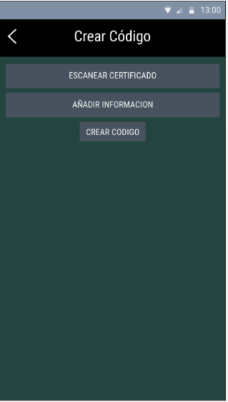
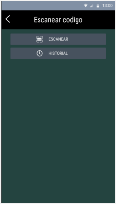

(Pantalla 1) “VaxID” es una aplicación enfocada a la regulación y validación de gente vacunada en contra del Covid-19, con posible aplicación a otras posibles futuras pandemias o incluso brotes locales de enfermedades contagiosas. El objetivo de la aplicación es brindar una forma de verificar la vacunación de una persona sin necesidad de contacto alguno ni complicaciones con tener certificados a la mano, o casos de falsificación. Esto se logra a través de un proceso de verificación de los certificados de vacunación de los usuarios, creando despues un codigo QR personal que puede ser escaneado por otros usuarios.

(Pantalla 2) Al entrar a la aplicación, esta será la pantalla principal, donde se tiene 3 botones para proceder a las funciones de la aplicación. La opción recomendable para un nuevo usuario que ha sido vacunado recientemente es la de “Crear Código” donde proseguirá a brindar sus datos de vacunación para que sean verificados. La siguiente opción, que puede ser utilizada por cualquier usuario es “Escanear Código”, en la cual se puede verificar que otro usuario haya sido vacunado según su código QR, al igual que ver todos los scans realizados por el usuario.

(Pantalla 3)  Para crear un código personal para cada usuario que haya sido legítimamente vacunado, se requiere un escaneo de su

certificado de vacunación, al igual que información adicional como su nombre y foto. Todo este proceso debe ser lo más simple y fluido posible, tomando en cuenta que una gran mayoría de las personas vacunadas en todo el mundo son de tercera edad. Al entrar a la opción “Escanear Certificado” se procederá a acceder a la cámara del dispositivo para tomar una foto del certificado de vacunación, indicando que esta sea lo más detallada posible. Cuando se haya tomado y elegido la foto correcta, se regresará a la Pantalla 3, para proseguir con la entrega de datos

adicionales, hasta que todos los datos requeridos hayan sido brindados, el botón “crear código” aparecerá más oscuro, y no podrá ser apretado aun.

(Pantalla 4) Brindando sus nombres y apellidos, al igual que indicando el lugar donde fue vacunado el usuario, finalmente se tiene suficiente información para ser enviada al mismo centro de vacunación, donde se verificará la veracidad de los datos. El usuario puede escoger una foto o tomar una nueva en ese momento. Cuando cada espacio sea llenado los cuadrados a su lado se llenarán con un tick, una vez que se llenen todos se regresará a la pantalla 3, en la cual el usuario podrá apretar el botón “Crear código” y se procede a la pantalla 5. (Pantalla 5) Una vez que se envía los datos para verificación, se mostrará esta pantalla al usuario, y solo queda esperar. Ahora cada vez que se quiera entrar a la opción “Crear Código” desde la pantalla 2 se mostrará esta misma pantalla hasta que hayan sido verificados los datos del usuario. En un escenario práctico el tiempo ideal de espera podría ser 1 día o menos. Una vez se reciba un resultado se enviará una notificación al usuario, y al entrar se mostrará la pantalla 6 o pantalla 7.

(Pantalla 6) Si se recibe una confirmación de la veracidad de los datos del usuario de parte del centro de vacunación, se creará un código QR único para identificar al usuario, almacenado junto a la foto y datos del usuario. Entonces se mostrará esta pantalla al entrar a la notificación que se manda al usuario. Al apretar “Continuar” se procede a mostrar la pantalla 8, donde se muestra el código QR creado para el usuario, junto a su nombre y foto.

(Pantalla 7) En caso de que los datos del usuario sean rechazados, se mostrará esta pantalla al entrar a la notificación enviada al dispositiva, donde se mostrará un mensaje de parte del centro de vacunacion (Ejemplo: Nombre no aparece en base de datos, La foto es de mala calidad, etc.) En este caso los datos del usuario serán eliminados y se reiniciará con el proceso de registro, para dar una nueva oportunidad de verificarse.

(Pantalla 8) Una vez haya sido creado el código personal del usuario, es creado el perfil donde se puede ver el código al igual que su foto y nombre. Desde la pantalla 2, al entrar a la opción “Ver mi código” se ingresa a este perfil, el cual puede ser escaneado por otros usuarios cuando se quiera ingresar a un vuelo, por ejemplo. Igualmente al escanear el código QR de otro usuario se puede ver un perfil de este estilo, para que el usuario que lo escanea pueda ver su foto y asegurarse de que sea la misma persona que la que está registrada como vacunada.

(Pantalla 9) Cuando se procede con la opción “Escanear Código”, el usuario puede escanear otros códigos QR con tal de verificar si otra persona ha sido vacunada, al apretar el botón “ESCANEAR” se accede a la cámara y ésta actúa como scanner de código QR. La aplicación entonces procede a verificar si el código QR está registrado y con qué datos adicionales. Al confirmar el código, se procede a mostrar un perfil como el de la pantalla 8. En caso de no ser un código real registrado en la app, se muestra un mensaje de error. Igualmente el usuario puede acceder a un historial de todos los perfiles que ha escaneado con la aplicación (Pantalla 11).

(Pantalla 10) Esta pantalla es como se verá la aplicación cuando un usuario esté escaneando un código QR, aquí en vez del fondo plomo se ve una imagen de lo que ve la camara del telefono.![ref1]![ref1]

(Pantalla 11) En caso de realizar un evento exclusivamente para personas vacunadas, o requerir una lista de pasajeros para volar a un destino que requiera vacunación para ingresar, la aplicación guardará los datos de los usuarios escaneados y mostrará una lista de todos los perfiles vistos, desde esta pantalla también se puede ir a la pantalla 10 apretando el botón verde claro, para escanear otro código, o también se puede borrar todos los registros de la lista, para empezar con una nueva.

[ref1]: Aspose.Words.7ec5495f-a1fb-49ee-8e72-2e6712b5c0e1.010.png
